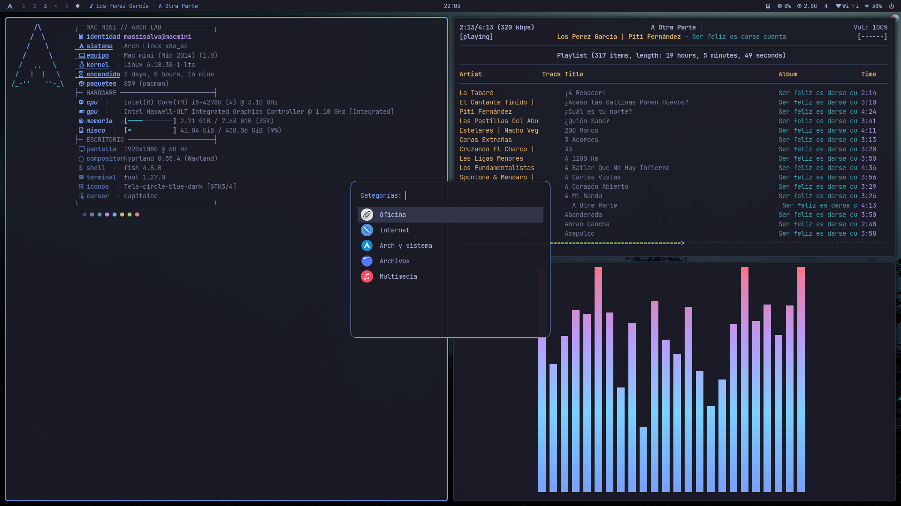

# Arch Linux en un Mac mini 2014

[](https://github.com/massisalva/macmini-arch-omarchy/actions/workflows/ci.yml)

Esta es mi configuración de Arch Linux para un Mac mini de 2014. Usa
Hyprland, conserva un consumo moderado para 8 GB de RAM y toma ideas visuales
de [Omarchy](https://github.com/basecamp/omarchy), sin copiar su instalación
completa.

El repositorio contiene dotfiles, listas de paquetes, scripts de instalación,
backups y notas para reconstruir el escritorio o adaptarlo a otra computadora.



## La computadora

| Componente | Detalle |
| --- | --- |
| Modelo | Apple Mac mini Late 2014 (`Macmini7,1`) |
| Procesador | Intel Core i5-4278U, 2 núcleos y 4 hilos |
| Gráficos | Intel HD Graphics 5100 con `i915` |
| Memoria | 8 GB de RAM y ZRAM |
| Almacenamiento | SSD Kingston A400 de 480 GB |
| Pantalla | Samsung 1920×1080 a 60 Hz |
| Wi-Fi | Broadcom BCM4360 con `broadcom-wl-dkms` |
| Arranque | UEFI, Limine y kernel Linux LTS |

La configuración prioriza estabilidad y fluidez sobre efectos pesados. El
blur usa una sola pasada, las animaciones son breves y el fondo es estático.

## El escritorio

- **Compositor:** Hyprland sobre Wayland, iniciado mediante UWSM.
- **Barra:** Waybar con escritorios, música, sistema, red, audio y energía.
- **Aplicaciones:** Fuzzel, con búsqueda plana y un cajón por categorías.
- **Terminal:** Foot con Fish; Bash se conserva para scripts y recuperación.
- **Notificaciones:** Mako.
- **Bloqueo e inactividad:** Hyprlock e Hypridle.
- **Audio:** PipeWire, WirePlumber y SwayOSD.
- **Archivos:** Thunar para uso gráfico y Yazi para terminal.
- **Red:** iwd con Impala; NetworkManager queda instalado para rollback.

El botón de Arch en Waybar abre un menú con Oficina, Internet, Sistema,
Archivos y Multimedia. `Super + D` mantiene la búsqueda rápida tradicional de
Fuzzel.

## Apariencia

La fuente principal es **JetBrains Mono Nerd Font**. Noto Sans, Noto Emoji,
DejaVu y fuentes compatibles con Microsoft Office completan documentos y
símbolos.

La paleta está basada en **Tokyo Night**:

| Uso | Color |
| --- | --- |
| Fondo | `#1a1b26` |
| Texto | `#a9b1d6` |
| Superficie | `#32344a` |
| Azul de acento | `#7aa2f7` |
| Cian | `#7dcfff` |
| Violeta | `#bb9af7` |
| Verde | `#9ece6a` |
| Amarillo | `#e0af68` |
| Rojo | `#f7768e` |

GTK conserva Adwaita oscuro, con iconos **Tela Circle Blue Dark** y cursor
**Capitaine**. Foot, Fuzzel, Waybar, Fish, Fastfetch y Zathura comparten la
misma familia de colores.

## Ajustes personales

- Fish sin saludo inicial, prompt coloreado y abreviaturas para Git.
- FZF integrado en Fish: `Ctrl + R`, `Ctrl + T` y `Alt + C`.
- Zoxide para saltar a carpetas frecuentes con `z nombre`.
- Git Delta para diffs más legibles.
- Fastfetch personalizado, disponible mediante `ff`.
- Cajón Fuzzel por categorías y entradas técnicas ocultas.
- Módulo musical de Waybar compatible con MPD, ncspot, PyRadio, MPV y Firefox.
- Firefox sobre Wayland con VA-API; se evita AV1 porque Haswell no lo acelera.
- SSH y LocalSend permitidos por UFW únicamente desde la red local.

Los valores particulares que no deben publicarse viven en
`~/.config/hypr/personal.conf`. Los wallpapers, reportes, backups, perfiles
Wi-Fi y credenciales están excluidos de Git.

## Aplicaciones incluidas

### Trabajo y documentos

- Firefox y 1Password.
- LibreOffice Still en español, Hunspell argentino, silabeo y sinónimos.
- Fuentes Liberation, Carlito y Caladea para compatibilidad con Office.
- Zathura y QPDF para leer y trabajar con PDF.
- Mousepad para texto plano y Galculator para cálculos rápidos.
- OneDrive y LocalSend para sincronización y transferencia.

### Archivos y multimedia

- Thunar, Yazi, Xarchiver, 7zip, ZIP y Unrar.
- IMV para imágenes y MPV para video.
- MPD, ncmpcpp, ncspot, PyRadio y Cava para música.
- Pavucontrol, Blueman, Impala y Bluetui como interfaces de administración.

### Terminal y diagnóstico

- Git, GitHub CLI, Ripgrep, FD, FZF, Bat, Eza y Tree.
- Btop, Fastfetch, Lsof, Strace, Nmap, Dig, Rsync e ImageMagick.
- Node.js, npm, Python, pipx y UV para experimentar y desarrollar.

Las listas completas y separadas por función están en
[`packages/`](packages/README.md).

## Atajos principales

| Atajo | Acción |
| --- | --- |
| `Super + Enter` | Abrir Foot con Fish |
| `Super + D` | Buscar aplicaciones con Fuzzel |
| `Super + B` | Abrir Firefox |
| `Super + C` | Abrir Galculator |
| `Super + E` | Abrir Yazi |
| `Super + Shift + F` | Abrir Thunar |
| `Super + P` | Abrir Btop |
| `Super + M` | Abrir ncmpcpp |
| `Super + V` | Historial del portapapeles |
| `Super + F` | Pantalla completa |
| `Super + Ctrl + Espacio` | Centrar ventana flotante |
| `Super + Q` | Cerrar ventana |
| `Super + Ctrl + L` | Bloquear sesión |
| `Super + Shift + S` | Menú de capturas |
| `Super + 1…0` | Cambiar de workspace |

Los movimientos usan `Super + H/J/K/L` o las flechas. Con `Shift` mueven la
ventana. La lista completa está en
[`50-bindings.conf`](dotfiles/.config/hypr/conf.d/50-bindings.conf).

## Instalación rápida

Esta guía parte de un Arch Linux funcional, con red, un usuario normal y
acceso a `sudo`. No particiona discos ni instala Arch desde cero.

### 1. Clonar el proyecto

```bash
sudo pacman -Syu --needed git
git clone https://github.com/massisalva/macmini-arch-omarchy.git
cd macmini-arch-omarchy
```

### 2. Instalar escritorio y hardware

Este perfil corresponde al Mac mini 2014. En otro equipo hay que revisar el
kernel, sus headers, microcódigo y controlador de red antes de instalarlo.

```bash
mapfile -t packages < <(
  sed -E '/^[[:space:]]*(#|$)/d' \
    packages/desktop.txt \
    packages/hardware-macmini.txt \
    packages/rollback.txt
)
sudo pacman -S --needed "${packages[@]}"
```

### 3. Instalar aplicaciones y herramientas

```bash
mapfile -t packages < <(
  sed -E '/^[[:space:]]*(#|$)/d' \
    packages/applications.txt \
    packages/development.txt \
    packages/administration.txt
)
sudo pacman -S --needed "${packages[@]}"
```

Los paquetes de [`optional-aur.txt`](packages/optional-aur.txt) son personales
y deben revisarse e instalarse por separado con un helper de AUR.

### 4. Revisar y desplegar los dotfiles

```bash
./scripts/check.sh
./scripts/install-dotfiles.sh --dry-run
./scripts/install-dotfiles.sh
```

El instalador crea un backup fechado antes de copiar nada. También crea
`personal.conf` si todavía no existe y recarga Hyprland, Waybar y Mako cuando
están disponibles.

### 5. Iniciar el escritorio

```bash
systemctl --user enable --now pipewire.socket pipewire-pulse.socket wireplumber.service
sudo systemctl enable --now bluetooth.service
uwsm start hyprland.desktop
```

Fish puede elegirse como shell de inicio sin eliminar Bash:

```bash
chsh -s /usr/bin/fish
```

## Cómo personalizarlo

1. **Wallpaper:** copiar una imagen a `~/.config/hypr/wallpaper.png`. No se
   versiona; si falta, se usa el fondo sólido Tokyo Night.
2. **Monitor y teclado:** editar `10-monitors.conf` y `20-input.conf`.
3. **Apariencia:** ajustar `30-look.conf`, Waybar, Foot o Fuzzel dentro de
   `dotfiles/.config/` y volver a ejecutar el instalador.
4. **Atajos:** editar `50-bindings.conf` y ejecutar `hyprctl reload`.
5. **Menú por categorías:** modificar `dotfiles/.local/bin/app-drawer`.
6. **Cambios privados:** guardarlos en `~/.config/hypr/personal.conf`.

Antes de desplegar un cambio:

```bash
./scripts/check.sh
./scripts/install-dotfiles.sh --dry-run
```

Para restaurar un backup:

```bash
./scripts/restore-dotfiles.sh backups/FECHA-HORA
```

## Red y particularidades del Mac mini

La Broadcom BCM4360 necesita `broadcom-wl-dkms`. La migración opcional desde
NetworkManager hacia iwd está automatizada, pero debe ejecutarse localmente y
no por SSH:

```bash
sudo ./scripts/migrate-wifi-to-iwd.sh
```

El procedimiento, sus límites regulatorios y el rollback están explicados en
[`docs/wifi-impala.md`](docs/wifi-impala.md). La instalación detallada desde
una base limpia está en
[`docs/install-from-clean-arch.md`](docs/install-from-clean-arch.md).

## Mantenimiento

```bash
./scripts/health-check.sh  # comprobación cotidiana
./scripts/audit.sh         # auditoría completa y privada
./scripts/audit-smart.sh   # salud del SSD; requiere sudo
```

Los informes quedan en `reports/local/` y nunca se publican automáticamente.
Para retomar el trabajo después de otra sesión, consultar
[`docs/CONTINUAR.md`](docs/CONTINUAR.md).

## Licencia

[MIT](LICENSE)
